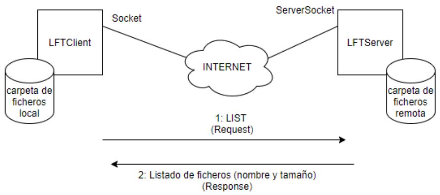

# LIGHT FILE TRANSFER

TRABAJO DE REDES DE COMPUTADORES II (2022-23): PROGRAMACIÓN DE UNA APLICACIÓN CLIENTE-SERVIDOR EN RED

## 1\. DESCRIPCIÓN DE LA APLICACIÓN

Se desea crear una aplicación para la transferencia de ficheros a través de la red "light file transfer (LFT)". La aplicación tendrá una parte servidora llamada LFTS (LFT Server) que permitirá conexiones con sockets comunes y a través de sockets SSL.

La aplicación cliente se llamará `LFTClient` y la aplicación servidora se llamará `LFTServer`. El esquema de funcionamiento será el siguiente:

<div align="center">



</div>

Cuando un cliente se conecte al servidor deberá mandar peticiones al servidor "Request". Estas peticiones pueden ser:

- _**LIST**_: listará los ficheros almacenados en una carpeta del servidor
- _**GET**_ &lt;nombre_fichero&gt;: el servidor transferirá al cliente el fichero con nombre `nombre_fichero`
- _**PUT**_ &lt;nombre_fichero&gt;: el cliente transferirá al servidor el fichero con nombre `nombre_fichero`

Al recibir la petición, el servidor mandará una respuesta "Response"
apropiada a la petición:

- Si la petición fue **LIST**, el servidor enviará un listado de ficheros indicando, por cada fichero en la carpeta del servidor, el nombre y el tamaño de este.
- Si la petición fue **GET**, el servidor enviará el fichero el fichero solicitado.
- Si la petición fue **PUT**, el servidor almacenará en la carpeta el fichero recibido y confirmará su recepción devolviendo al cliente el número de bytes recibidos.

## 2\. PARÁMETROS DE LA LÍNEA DE COMANDOS

Para invocar la ejecución del _**servidor**_ podrán especificarse los siguientes parámetros:

<div align="center">

<i><b>java LFTServer &lt;modo&gt; &lt;puerto&gt; &lt;carpeta_servidor&gt; &lt;max_clientes&gt;</b></i>

</div>

**&lt;modo&gt;**: Para establecer si la aplicación funciona con sockets comunes o Sockets SSL se utilizán argumentos en la línea de comandos. 

Por ejemplo, para arrancar el servidor en modo SSL se puede especificar el parámetro modo:
- `java LFTServer modo=SSL` arranca en modo SSL
- `java LFTServer #arranca` arranca en modo normal

**&lt;puerto&gt;**: número de puerto donde escucha el servidor.

Ejemplo: `puerto=8025`

```console
java LFTServer modo=SSL puerto=8025
```

**&lt;carpeta_servidor&gt;**: carpeta en la que el servidor almacenará y servirá los ficheros (no es necesario implementar carpetas recursivas)

Por ejemplo: `carpeta_servidor=/var/lft_server`

```console
java LFTServer modo=SSL puerto=8025 carpeta_servidor=/var/lft_server
```

**&lt;max_clientes&gt;**: número máximo número de hilos que el servidor puede crear para clientes.

Por ejemplo, para levantar el servidor en modo normal en el puerto 1721, con la carpeta `/var/lft/carpeta` y un máximo de 10 clientes:

```console
java LFTServer puerto=1721 carpeta_servidor=/var/lft/carpeta max_clientes=10
```

---

Para la invocación del cliente se podrán especificar los siguientes parámetros:

<div align="center">

<i><b>java LFTServer &lt;modo&gt; &lt;host&gt; &lt;puerto&gt; &lt;carpeta_cliente&gt;</b></i>

</div>

**&lt;modo&gt;**: Al igual que el servidor establecerá si se lanza un socket cliente común o uno SSL.

**&lt;host&gt;**: dirección del servidor al que se va a conectar

**&lt;puerto&gt;**: número de puerto del servidor al que se va a conectar

**&lt;carpeta_cliente&gt;**: carpeta donde se almacenan los ficheros transferidos desde el servidor y desde dónde enviará ficheros al servidor.

Por ejemplo, para conectar el cliente al puerto 1721 del servidor `192.168.1.33` en modo SSL en la carpeta `c:\flt`:

```console
java LFTClient modo=SSL host=192.168.1.33 puerto=1721 carpeta_cliente=c:\lft
```

## 3\. CONSIDERACIONES

- Tanto servidor como cliente reportarán errores a un fichero de _log_ "`errores.log`" que se almacenará en el directorio donde se ubiquen los binarios. En este _log_ se almacenarán tanto los errores por falta de permisos a la hora de acceder a ficheros, como errores de sintaxis a la hora de aceptar comandos (por ejemplo, poner _**GET**_ sin nombre de fichero) y errores a la hora de gestionar las conexiones.
- Cada comando procesado tanto por el cliente como por el servidor se reportarán a un fichero llamado `acciones.log`
- Se deberán tratar las excepciones necesarias para que tanto el servidor como el cliente, se mantengan activos sin cerrarse  abruptamente.

---

### Ejemplo de ejecución en una misma máquina (JSON)

```json
        /*
        ! CONFIGURACIÓN PARA EL PROCESO SERVIDOR
        */
        {
            "type": "java",
            "name": "LFTServer",
            "request": "launch",
            "mainClass": "LFTServer",
            "projectName": "redesIItteorico",
            // "args": ["7133", "/home/raul/LFT_Servidor", "1"]
            "args": ["modo=SSL", "7133", "/home/raul/LFT_Servidor", "3"]
        },
        /*
        CONFIGURACIÓN PARA EL PROCESO CLIENTE
        */
        {
            "type": "java",
            "name": "LFTClient",
            "request": "launch",
            "mainClass": "LFTClient",
            "projectName": "redesIItteorico",
            // "args": ["127.0.0.1", "7133", "/home/raul/LFT_Cliente"]
            "args": ["modo=SSL", "127.0.0.1", "7133", "/home/raul/LFT_Cliente"] // DESDE LA MISMA MAQUINA
        }
```